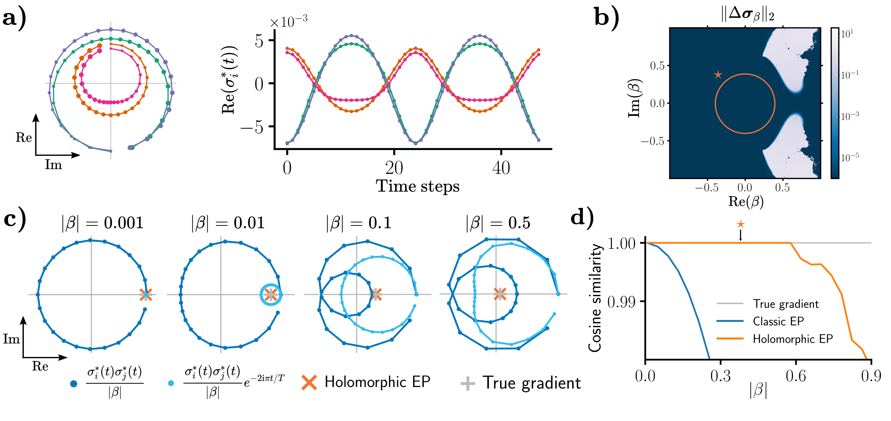

# Holomorphic Equilibrium Propagation Computes Exact Gradients Through Finite Size Oscillations



This file contains the instructions for reproducing the results and figures of the paper.

## Installing the environment

All the simulations use [Jax](https://github.com/google/jax), [Haiku](https://github.com/deepmind/dm-haiku), [TensorFlow](https://github.com/tensorflow/tensorflow), and [TensorFlow Datasets](https://www.tensorflow.org/datasets?hl=en).
To install the environment with the latest Jax/Jaxlib (requires python>=3.7): 

```
python3 -m venv holo_ep
source holo_ep/bin/activate
pip install --upgrade pip setuptools
pip install --upgrade "jax[cuda]" -f https://storage.googleapis.com/jax-releases/jax_releases.html
pip install git+https://github.com/deepmind/dm-haiku
pip install tensorflow
pip install tensorflow-datasets
```

Alternatively, an older version of jaxlib may be installed for python 3.6

```
python3 -m venv holo_ep
source holo_ep/bin/activate
pip install --upgrade pip setuptools
pip install --upgrade jax jaxlib==0.1.64+cudaXXX -f https://storage.googleapis.com/jax-releases/jax_releases.html
pip install git+https://github.com/deepmind/dm-haiku
pip install tensorflow
pip install tensorflow-datasets
```

Where XXX must be replaced by the cuda version : e.g. 101 for cuda 10.1
The installation assumes that cuda is at /usr/local/cuda-XX.X see JAX repo for instructions.

## The code

### Scripts

The executable Python files are at the root of the repo, and the modules are in `models/` and `utils/`.
The scripts are:

* `dynamics.py` for running the dynamics of the neural network.
* `sweep_beta.py` for scanning the gradient estimate in function of teaching amplitude.
* `stability_map.py` for scanning the existence of fixed points for complex beta.
* `train.py` for training neural networks.
* `outer_dynamics.py` for running the dynamics with a changing beta.

### Argument files

The script only needs one argument which is the path to a json file containing the actual arguments of the script.
Each script has a slightly different argument file format.

### Running the code

To run a simulation, execute the Python script with the path to the hyperparameters json file:

```
python script.py path/to/hyperparameters.json
```

The results of the simulation will be created in `./results/{script_name}/{date_simulation_name}`, and will contain the data generated by the simulation as a pickled dictionnary, the logs, and a copy of the hyperparameters json file for reproduction.
The following table indicates the script corresponding to each experimental result of the paper.

| Result        | Script              |
| ------------- |:-------------------:|
| Fig. 2ac      | `dynamics.py`       |
| Fig. 2b       | `stability_map.py`  |
| Fig. 2d       | `sweep_beta.py`     |
| Fig. 3ab      | `outer_dynamics.py` |
| Fig. 3c       | `sweep_beta.py`     |
| Fig. 4ab      | `sweep_beta.py`     |
| Fig. 4c       | `train.py`          |
| Table 1       | `train.py`          |
| Table 2       | `train.py`          |


## Figures

The figures are plotted in the notebook `plot_figures.ipynb`.
A separate environment with jupyter-notebook, matplotlib and numpy is required.


